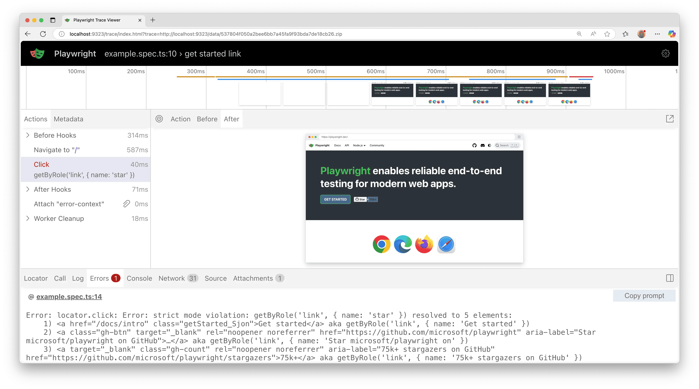

import Tabs from '@theme/Tabs';
import TabItem from '@theme/TabItem';
import HTMLCard from '@site/src/components/HTMLCard';

## Introduction

Playwright tests can be run on any CI provider. In this section we cover running tests on GitHub using GitHub Actions. If you would like to see how to configure other CI providers, check out our detailed [doc on Continuous Integration](./ci.mdx).

#### You will learn
- [How to set up GitHub Actions](/ci-intro.mdx#setting-up-github-actions)
- [How to view test logs](/ci-intro.mdx#viewing-test-logs)
- [How to view the trace](/ci-intro.mdx#viewing-the-trace)

## Setting up GitHub Actions

To add a [GitHub Actions](https://docs.github.com/en/actions) file, first create `.github/workflows` folder and inside it add a `playwright.yml` file containing the example code below so that your tests run on each push and pull request for the main/master branch.

```yml title=".github/workflows/playwright.yml"
name: Playwright Tests
on:
  push:
    branches: [ main, master ]
  pull_request:
    branches: [ main, master ]
jobs:
  test:
    timeout-minutes: 60
    runs-on: ubuntu-latest
    steps:
    - uses: actions/checkout@v5
    - name: Set up Python
      uses: actions/setup-python@v6
      with:
        python-version: '3.13'
    - name: Install dependencies
      run: |
        python -m pip install --upgrade pip
        pip install -r requirements.txt
    - name: Ensure browsers are installed
      run: python -m playwright install --with-deps
    - name: Run your tests
      run: pytest --tracing=retain-on-failure
    - uses: actions/upload-artifact@v4
      if: ${{ !cancelled() }}
      with:
        name: playwright-traces
        path: test-results/
```

To learn more about this, see ["Understanding GitHub Actions"](https://docs.github.com/en/actions/learn-github-actions/understanding-github-actions).

Looking at the list of steps in `jobs.test.steps`, you can see that the workflow performs these steps:
1. Clone your repository
1. Install language dependencies
1. Install project dependencies and build
1. Install Playwright Browsers
1. Run tests

## Create a Repo and Push to GitHub

Once you have your [GitHub Actions workflow](#setting-up-github-actions) setup, then all you need to do is [Create a repo on GitHub](https://docs.github.com/en/get-started/quickstart/create-a-repo) or push your code to an existing repository. Follow the instructions on GitHub and don't forget to [initialize a git repository](https://github.com/git-guides/git-init) using the `git init` command so you can [add](https://github.com/git-guides/git-add), [commit](https://github.com/git-guides/git-commit), and [push](https://github.com/git-guides/git-push) your code.

###### 


## Opening the Workflows

Click on the **Actions** tab to see the workflows. Here you see if your tests have passed or failed.

###### 


## Viewing Test Logs

Clicking on the workflow run shows you all the actions that GitHub performed and clicking on **Run Playwright tests** shows the error messages, what was expected and what was received as well as the call log.

###### 


## Viewing the Trace

[trace.playwright.dev](https://trace.playwright.dev) is a statically hosted variant of the Trace Viewer. You can upload trace files using drag and drop.



## Properly handling Secrets

Artifacts like trace files or console logs contain information about your test execution. They can contain sensitive data like user credentials for a test user, access tokens to a staging backend, testing source code, or sometimes even your application source code. Treat these files just as carefully as you treat that sensitive data. If you upload reports and traces as part of your CI workflow, make sure that you only upload them to trusted artifact stores, or that you encrypt the files before upload. The same is true for sharing artifacts with team members: Use a trusted file share or encrypt the files before sharing.

## What's Next
- [Learn how to use Locators](./locators.mdx)
- [Learn how to perform Actions](./input.mdx)
- [Learn how to write Assertions](./test-assertions.mdx)
- [Learn more about the Trace Viewer](/trace-viewer.mdx)
- [Learn more ways of running tests on GitHub Actions](/ci.mdx#github-actions)
- [Learn more about running tests on other CI providers](/ci.mdx)


[APIRequest]: /api/class-apirequest.mdx "APIRequest"
[APIRequestContext]: /api/class-apirequestcontext.mdx "APIRequestContext"
[APIResponse]: /api/class-apiresponse.mdx "APIResponse"
[APIResponseAssertions]: /api/class-apiresponseassertions.mdx "APIResponseAssertions"
[Browser]: /api/class-browser.mdx "Browser"
[BrowserContext]: /api/class-browsercontext.mdx "BrowserContext"
[BrowserType]: /api/class-browsertype.mdx "BrowserType"
[CDPSession]: /api/class-cdpsession.mdx "CDPSession"
[Clock]: /api/class-clock.mdx "Clock"
[ConsoleMessage]: /api/class-consolemessage.mdx "ConsoleMessage"
[Dialog]: /api/class-dialog.mdx "Dialog"
[Download]: /api/class-download.mdx "Download"
[ElementHandle]: /api/class-elementhandle.mdx "ElementHandle"
[Error]: /api/class-error.mdx "Error"
[FileChooser]: /api/class-filechooser.mdx "FileChooser"
[Frame]: /api/class-frame.mdx "Frame"
[FrameLocator]: /api/class-framelocator.mdx "FrameLocator"
[JSHandle]: /api/class-jshandle.mdx "JSHandle"
[Keyboard]: /api/class-keyboard.mdx "Keyboard"
[Locator]: /api/class-locator.mdx "Locator"
[LocatorAssertions]: /api/class-locatorassertions.mdx "LocatorAssertions"
[Mouse]: /api/class-mouse.mdx "Mouse"
[Page]: /api/class-page.mdx "Page"
[PageAssertions]: /api/class-pageassertions.mdx "PageAssertions"
[Playwright]: /api/class-playwright.mdx "Playwright"
[Request]: /api/class-request.mdx "Request"
[Response]: /api/class-response.mdx "Response"
[Route]: /api/class-route.mdx "Route"
[Selectors]: /api/class-selectors.mdx "Selectors"
[TimeoutError]: /api/class-timeouterror.mdx "TimeoutError"
[Touchscreen]: /api/class-touchscreen.mdx "Touchscreen"
[Tracing]: /api/class-tracing.mdx "Tracing"
[Video]: /api/class-video.mdx "Video"
[WebError]: /api/class-weberror.mdx "WebError"
[WebSocket]: /api/class-websocket.mdx "WebSocket"
[WebSocketRoute]: /api/class-websocketroute.mdx "WebSocketRoute"
[Worker]: /api/class-worker.mdx "Worker"
[Element]: https://developer.mozilla.org/en-US/docs/Web/API/element "Element"
[EvaluationArgument]: /evaluating.mdx#evaluation-argument "EvaluationArgument"
[Promise]: https://developer.mozilla.org/en-US/docs/Web/JavaScript/Reference/Global_Objects/Promise "Promise"
[iterator]: https://developer.mozilla.org/en-US/docs/Web/JavaScript/Reference/Iteration_protocols "Iterator"
[origin]: https://developer.mozilla.org/en-US/docs/Glossary/Origin "Origin"
[selector]: https://developer.mozilla.org/en-US/docs/Web/CSS/CSS_Selectors "selector"
[Serializable]: https://developer.mozilla.org/en-US/docs/Web/JavaScript/Reference/Global_Objects/JSON/stringify#Description "Serializable"
[UIEvent.detail]: https://developer.mozilla.org/en-US/docs/Web/API/UIEvent/detail "UIEvent.detail"
[UnixTime]: https://en.wikipedia.org/wiki/Unix_time "Unix Time"
[xpath]: https://developer.mozilla.org/en-US/docs/Web/XPath "xpath"

[Any]: https://docs.python.org/3/library/typing.html#typing.Any "Any"
[bool]: https://docs.python.org/3/library/stdtypes.html "bool"
[bytes]: https://docs.python.org/3/library/stdtypes.html#bytes "bytes"
[Callable]: https://docs.python.org/3/library/typing.html#typing.Callable "Callable"
[EventContextManager]: https://docs.python.org/3/reference/datamodel.html#context-managers "Event context manager"
[EventEmitter]: https://pyee.readthedocs.io/en/latest/#pyee.BaseEventEmitter "EventEmitter"
[Exception]: https://docs.python.org/3/library/exceptions.html#Exception "Exception"
[Dict]: https://docs.python.org/3/library/typing.html#typing.Dict "Dict"
[float]: https://docs.python.org/3/library/stdtypes.html#numeric-types-int-float-complex "float"
[int]: https://docs.python.org/3/library/stdtypes.html#numeric-types-int-float-complex "int"
[List]: https://docs.python.org/3/library/typing.html#typing.List "List"
[NoneType]: https://docs.python.org/3/library/constants.html#None "None"
[Pattern]: https://docs.python.org/3/library/re.html "Pattern"
[URL]: https://en.wikipedia.org/wiki/URL "URL"
[pathlib.Path]: https://realpython.com/python-pathlib/ "pathlib.Path"
[str]: https://docs.python.org/3/library/stdtypes.html#text-sequence-type-str "str"
[Union]: https://docs.python.org/3/library/typing.html#typing.Union "Union"
[datetime]: https://docs.python.org/3/library/datetime.html#datetime.datetime "datetime"

[all available image tags]: https://mcr.microsoft.com/en-us/product/playwright/python/about "all available image tags"
[Microsoft Artifact Registry]: https://mcr.microsoft.com/en-us/product/playwright/python/about "Microsoft Artifact Registry"
[Dockerfile.noble]: https://github.com/microsoft/playwright-python/blob/main/utils/docker/Dockerfile.noble "Dockerfile.noble"
